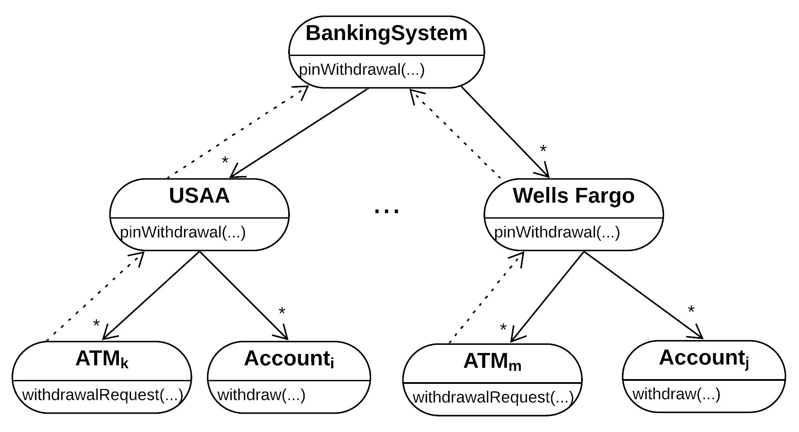
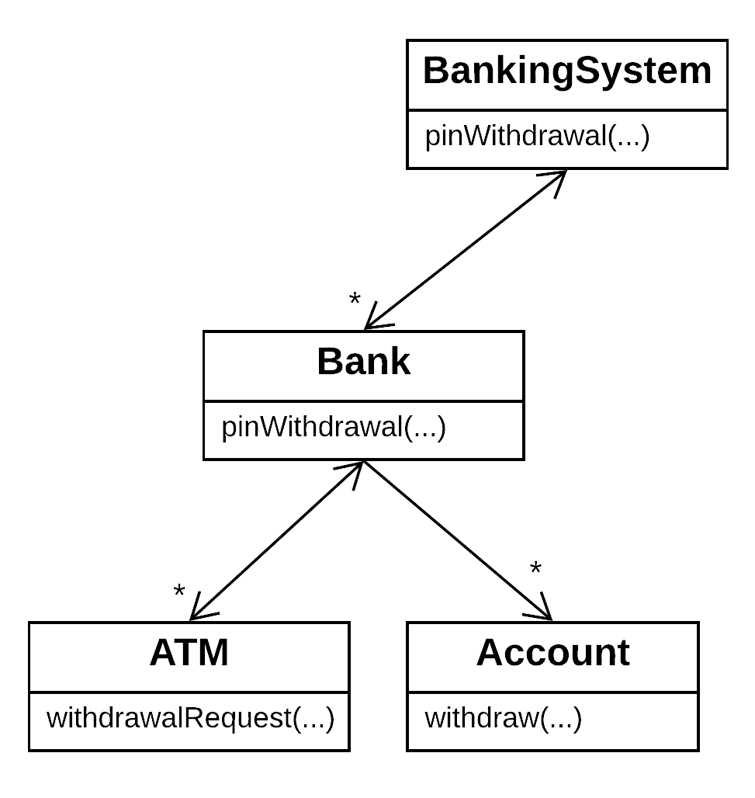
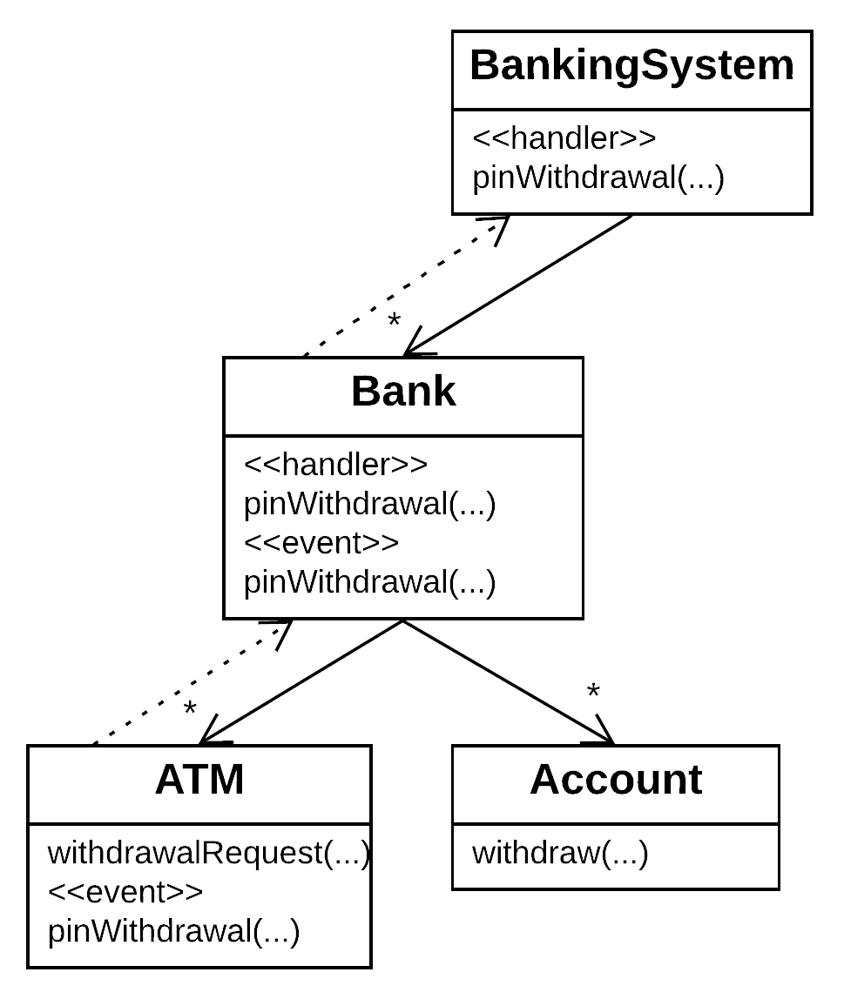

# BankingSystem

This is a small pedagogical project used to demonstrate several object-oriented design concepts.  In perusing this example, don't get too caught up in the fact that the example supposedly involves banking, in particular support for making a withdrawal from an ATM.  In no way is this example meant to show how banking software is, or should be, designed.  So many issues are glossed over, such as persistence and security, that could fundamentally affect what constitutes a good design.  This is really an example about Dependency Inversion, Design Patterns, Software Architecture, Design by Contract, and the like.

This repository contains three branches, each representing an example alternative design.  These alternatives all _attempt_ to express a hierarchical design that achieves a uses-hierarchy that is compliant with the [Law of Demeter](https://en.wikipedia.org/wiki/Law_of_Demeter), perhaps more helpfully named The Principle of Least Knowledge: an object should only talk to its friends, not its friends' friends.  For this case study, that means BankingSystems can know about Banks, but shouldn't know about ATMs.  Non-hierarchical dependencies or even overly-friendly hierarchical dependencies make software harder to incrementally develop, test, and deploy.  The diagram below is a conceptual diagram of how I think about the object interactions.

Parnas made similar arguments back in the 1970s in his papers on [Minimal Subsets](https://ieeexplore.ieee.org/document/1702387) and [Extension and Contraction](https://ieeexplore.ieee.org/document/1702607).  To take these ideas a little deeper, a designer should seek for minimal system knowledge in all classes, notably classes lower in the uses hierarchy.  For starters, only Banks know about ATMs, and only BankingSystems know about Banks.  However, it would also suggest that an ATM should only refer to primitive types (Strings, doubles), which, being ensconced in the programming language, are guaranteed to always be present.  I took this idea as an architectural rule in the example designs below, representing Accounts in the system as Strings (account numbers), PINs as Strings, amounts as doubles.  When low-level classes _do_ need to know things beyond primitive types, they should be interfaces.  Along with the primitive types, these primitive types and interfaces become [design rules](https://www.amazon.com/Design-Rules-Vol-Power-Modularity/dp/0262024667): public design knowledge that is asserted to be unchangeable, so that components can freely depend upon them without fear that they will be changed or removed, which would trigger ripples of change throughout the code base.

The choice to depend on primitive types also (mildly) demonstrates a concept I teach called _Data Over Code_, which argues that only differences in _behavior_ should be encoded into object methods.  In this case, the only behavior a PIN has is its identity (e.g., (in)equality), so having a PIN object would be overkill that would create an unnecessary class, and with it unnecessary object dependencies.  One might think that we need some kind of enforcement mechanism on PINs (and account numbers) involving, say, their length and uniqueness.  This is true, but a PIN object is not necessary for the former, and insufficient for the latter (without violating SRP).  A key tenet of DOC is that such properties (design rules!) should be achieved by employing an [Abstract Factory Pattern](https://en.wikipedia.org/wiki/Abstract_factory_pattern).  Such an object will have the special know-how of how a banking system is properly assembled, e.g., uniqueness of PINs, ensuring that an account number begins with an identifying bank prefix, and some architectural constraints discussed below.  This repository does not (yet) contain such an Abstract Factory, stay tuned.

Another concept employed in all three examples is [Design by Contract](https://ieeexplore.ieee.org/document/161279).  Here it is used primarily to keep the code base free of unnecessary checks, improving readability.  It was also useful in exposing that the atmWithddrawl method is complex (hard to write contracts for).  Admittedly, an attempt to more deeply apply DbC would expose further problems, driving additional refactorings to result in a more SRP and simpler design.

Finally, many of the above ideas, taken together, comprise [software architecture](http://www.cs.cmu.edu/afs/cs/project/able/www/paper_abstracts/intro_softarch.html).  At a high level, a software architecture is a concise expression of your overall software design in a few-to-several _components_ and _connectors_, regulated by a set of _constraints_.  In our design, we seek a hierarchical architecture in which a BankingSystem depends on Banks, which depend on ATMs, further constrained by design rules (or invariants, etc.).  In a sense, Architecture begins where interfaces and their contracts leave off, which are crafted on a per-interface or per-class basis.  Architecture asserts, for example, that "thou shalt use String account numbers when communicating about Accounts".  There's no one place in a code base to assert that, unless perhaps you're using [Aspect-Oriented software development](https://en.wikipedia.org/wiki/Aspect-oriented_programming) techniques.

With the basic design ideas now in place, what follows is a discussion of each design and the concepts and tradeoffs it embodies:

- [Master branch](https://github.com/wggster/BankingSystem): This is the "base" version of the program.  It's main positive feature is its simple and direct design.  Its failing is that ATMs "know about" Banks, and Banks "know about" BankingSystems.  The result is that this system could not be incrementally developed.  an ATM could not be tested until there were Banks and BankingSystems.  Beyond this, the ATM and Bank classes are not fully minding their business (not [SRP](https://en.wikipedia.org/wiki/Single-responsibility_principle)).  They know what result codes mean and act upon them.  This results in complex methods that are hard to write contracts for.  The key example here is that when a Bank here's back from the Grantor that the withdrawal request was approved, it calles method transfer to note that it gave out money to an account holder of another bank.  BankingSystem should be making that transfer.

- [Strategy branch](https://github.com/wggster/BankingSystem/tree/strategy): This is a fairly simple refactoring that employs [Dependency Inversion](https://en.wikipedia.org/wiki/Dependency_inversion_principle) (and I would say the [Strategy Pattern](https://en.wikipedia.org/wiki/Strategy_pattern) in particular) to break the above dependencies.  A Grantor interface was introduced so that ATM depends on a small abstract Grantor, not a big concrete Bank.  Grantor likewise allows Bank to depend on an abstract Grantor, not a concrete Banking System.  If we think in terms of a uses hierarchy, this is a significant improvement, in that we now have classes depending on abstractions.  This would allow testing ATMs and Banks using a mock Grantor (although see [Mocking is a Code Smell](https://medium.com/javascript-scene/mocking-is-a-code-smell-944a70c90a6a), which artfully makes the point that, in our case, ATM and Bank are not true units (in the unit testing sense) because of this dependency, abstract or not.  Parnas made similar arguments back in the 1970s in his papers on [Minimal Subsets](https://ieeexplore.ieee.org/document/1702387) and [Extension and Contraction](https://ieeexplore.ieee.org/document/1702607).  The use of the Strategy Pattern also does not address the shortcoming that ATM and Bank are not minding their own business.

- [MVP branch](https://github.com/wggster/BankingSystem/tree/mvp): This is actually a _hierarchical_ [Model-View-Presenter](https://en.wikipedia.org/wiki/Model%E2%80%93view%E2%80%93presenter).  It is a much more complex design, and only one of many possibilities in this particular genre.  There are perhaps better MVP solutions, but it does does demonstrate MVP.  This redesign acknowledges that an ATM has both input and output aspects, and they can be thought of as distinct responsibilities.  Whether these map to model and view, or, view and model, can be debated, because the example is too simple to make the distinction meaningful.  But it can be said that when certain inputs happen (a proper account, PIN, and dollar amount are provided), then money will be dispensed.  It would seem counterintuitive to handle this with events/implicit-invocation ala the [Observer Pattern](https://en.wikipedia.org/wiki/Observer_pattern), because an ATM should not have more than one Grantor.  True, so for this design, I considered that all sorts of Observers might be possible: auditors,[1](#footnote1) advertisers, etc.  However, we have to introduce an architectural design rule (constraint, invariant) that requires that there be no more than one Observer of an ATM that is a Grantor.[2](#footnote2)  True to MVP, what happens is that when an event is signalled, the Presenter (aka [Mediator](https://en.wikipedia.org/wiki/Mediator_pattern)) makes calls on the Model(s) and View to keep them in sync.  So, for example, when an ATM announces that there has been a withdrawal request, its owning Bank determines if its the owner of the account, and if it is it calls the ATM back with a dispense command.  However, because this example is demonstrating _hierarchical_ MVP, the Bank may find that it does not hold the Account, and then reannounces the withdrawal request, which the BankingSystem receives, looks for a Bank that holds the Account, and if so, calls the Bank back with a dispense (transfer) call.  A key difference between Observer and MVP is that in MVP the Presenter needs to know which objects (i.e., Models or parts of the Model) in particular need to be updated upon receiving an event.  Thus, when an ATM announces the withdrawal request, it includes itself in the request, so that the Presenter can update it appropriately.  Likewise, when the Bank re-announces, it includes itself in the announcement.  There are is a "trick" here, which is why I think this example could have a better solution.  In this latter case when a Bank announces that it has a withdrawal request, if the BankingSystem finds a Bank that holds the account, the originating ATM needs to be told it can dispense the funds, and there will be a transfer from one Account holder's Bank to the ATM-owner's Bank.  However, the BankingSystem only has a reference to the Bank, in order to enforce a uses-hierarchy that is compliant with the Principle of Least Knowledge.  In this case, that means BankingSystems can know about Banks, but shouldn't know about ATMs.  To comply with the PoLK, then, I decided to use a pseudo-[Decorator Pattern](https://en.wikipedia.org/wiki/Decorator_pattern), which decorated the announcing Bank with the announcing ATM, so that when the BankingSystem called to update the Bank with the successful withdrawal, the ATM was on hand and could be called by the Bank to dispense the funds.  There are many other solutions that I considered.  One was for the announcing Bank to include not just itself, but a <Bank,ATM> Pair in the announcement.  Structurally, it is little different than the Decorator solution, except that the Presenter (BankingSystem) can "see" the ATM.  This is not a violation of the PoLK as long as the Presenter does not invoke a method on ATM.  Thus, the compliant solution would have the BankingSystem pass the ATM back to the Bank (e.g., bankATMPair.key.transfer(bankATMPair.value).  Another solution would be for the announcing Bank to simply "remember" which ATM is "currently active", e.g., by adding a private field to the Bank like activeATM.  Then when the Bank is called back, it can access this field.  This is subject to errors, say if concurrency is later introduced, or if there is a recursive call sequence (although this latter case could be handled by having a Stack of activeATMs that the Bank pushes/pops).

I've really only scratched the surface here.  As mentioned above an Abstract Factory is really required to assemble the system.  This would not only allow expressing some key architectural constraints, but also move the "making" responsibility from class Main.  There are also MVP alternatives worth exploring, as discussed above.

More adventurously, rather different designs are possible.  Perhaps my design is upside down, and in fact that BankingSystem should be at the bottom of the hierarchy, and ATMs at the top.  Are there meaningful minimal subsets and extensions starting with this hierarchy?  Maybe.  More prosaicly, my TA (and PhD advisee) Dylan Lukes suggested that the BankingSystem should mediate between ATMs and Banks.  This unfortunately would deprive me of my hierarchical MVP example, but makes an interesting point, and certainly admits interesting minimal subsets and extensions.

_________________________________
<a name="footnote1">1</a>An auditor or similar behavior would probably be better provided through the Decorator Pattern so that it could stop improper transactions, not just observe and log them (although this creates the possibility of violating [LSP](https://en.wikipedia.org/wiki/Liskov_substitution_principle)).  This somewhat argues against the use of Observer or MVP for the ATM-Bank relationship, although the architectural design rule can still get the job done.

<a name="footnote2">2</a>This design rule could be enforced by implementing an Observer that accepts only one registrant, but this is overconstraining, e.g., does not allow for advertisers to hook in to trigger the display of an ad while you're waiting for your money.

